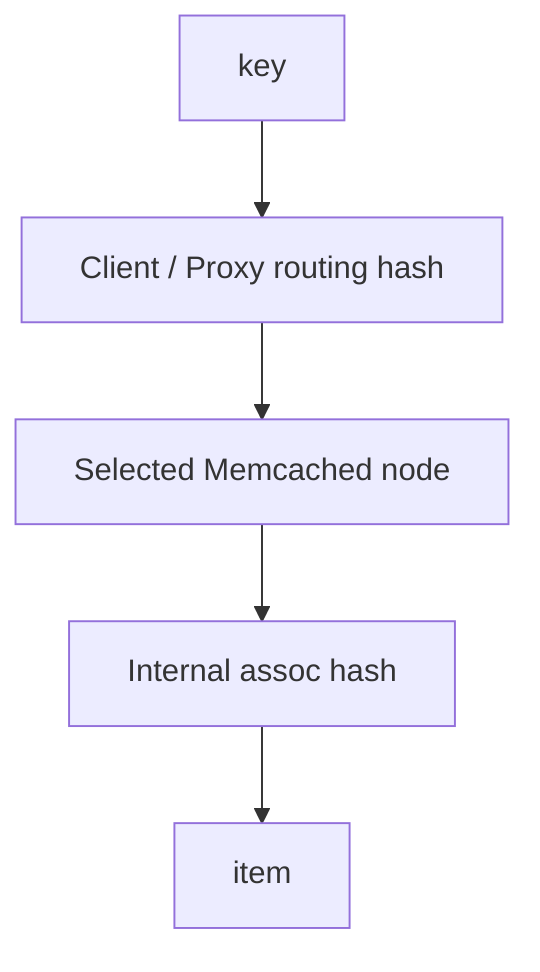

# 第 070 题 · Built-in Proxy 是否改变了传统模型？

> **P2** · ★★★☆☆ · 一致性哈希与分布式 Memcached  
> 本文是 PDF 对应题目的扩展版：保留原答案，并补充源码、复杂度、并发不变量、生产实践与实验。

## 题目

**Built-in Proxy 是否改变了传统模型？**

## 面试官在考什么

这道题用于判断候选人是否真正理解 **客户端/代理路由、一致性哈希、节点故障与控制面**。

面试官通常不会满足于“术语定义”，而会沿着 `Built-in Proxy 是否改变了传统模型？` 继续追问到：**状态如何变化、哪个模块拥有这份状态、并发下怎样保持不变量、生产中用什么指标证明判断**。优秀回答应先给 30 秒结论，再主动给出一个反例或故障场景。

## 30-90 秒标准回答

> 是。自 1.6.23 起可选内置 proxy 让客户端连接前端代理，由代理做 pool/routing/fallback/复制模式，后端仍是普通 Memcached。

面试时建议先讲上面这句话，再根据追问选择展开源码或生产侧影响，不要一开始就陷入函数细节。

## 心智模型

**路由与节点自治：** 传统 Memcached 把集群路由放到客户端：节点内部只管理自己的 KV。节点成员变化首先是“路由变化”，然后表现为缓存命中变化，而非数据库式数据迁移。



## 深度机制

### 1. 可将 smart client 复杂度集中到服务端。

从“路由与节点自治”看，这一结论的重点不是记住术语，而是明确职责边界和失败方式。传统 Memcached 把集群路由放到客户端：节点内部只管理自己的 KV。节点成员变化首先是“路由变化”，然后表现为缓存命中变化，而非数据库式数据迁移。
### 2. proxy 支持 Basic/Meta 并以配置脚本描述路由。

Meta Protocol 的价值在于用可扩展 flag/token 在一次往返中表达更多缓存状态，特别适合 anti-dogpiling、stale 和版本控制。
### 3. 代理也成为新的容量与故障域，需要 HA。

从“路由与节点自治”看，这一结论的重点不是记住术语，而是明确职责边界和失败方式。传统 Memcached 把集群路由放到客户端：节点内部只管理自己的 KV。节点成员变化首先是“路由变化”，然后表现为缓存命中变化，而非数据库式数据迁移。

## 系统不变量

- **不变量 1：** 同一 routing 配置下，同一个 key 应稳定映射到同一 owner。
- **不变量 2：** 节点成员变化不能假设存在自动数据迁移或复制。

这些不变量比记忆具体函数名更稳定。版本升级可能调整代码组织，但破坏这些约束通常意味着正确性或生命周期出现问题。

## 复杂度与性能分析

- 关注 membership 变化时的 remapping 比例、负载偏斜和单节点故障后的 miss 增量。
- 一致性哈希降低搬迁范围，但不自动降低 Hot Key 的单点压力。

进一步分析时要区分三个层面：**算法复杂度**（如 Hash 平均 O(1)）、**微架构成本**（cache miss、pointer chasing、cache-line bouncing）和 **系统成本**（RTT、序列化、回源）。高水平回答会主动指出这三者不是一回事。

## 源码导航


建议优先阅读以下 Memcached 1.6.45 文件：

- [`proxy_ring_hash.c`](https://github.com/memcached/memcached/blob/1.6.45/proxy_ring_hash.c)
- [`proxy_jump_hash.c`](https://github.com/memcached/memcached/blob/1.6.45/proxy_jump_hash.c)
- [`proto_proxy.c`](https://github.com/memcached/memcached/blob/1.6.45/proto_proxy.c)
- [`proxy_config.c`](https://github.com/memcached/memcached/blob/1.6.45/proxy_config.c)

源码阅读方法：先定位入口函数，再跟踪 **Item 指针如何变化、何时加锁、何时 publication/unlink、何时释放引用**。不要按文件从第一行顺序阅读。

## 工程与生产实践

1. **先确认语义边界：** 本题讨论的是 客户端/代理路由、一致性哈希、节点故障与控制面，先区分 server 内部机制、客户端路由和应用回源三层，避免跨层归因。
2. **把关键路径画出来：** 对 `Built-in Proxy 是否改变了传统模型？` 至少能指出输入、关键状态、输出以及失败路径；如果涉及 Item，要明确 Hash/LRU/Slab/refcount 中哪些会变化。
3. **用指标证伪：** 测 direct vs proxy 的 P50/P99、额外 RTT、proxy CPU、backend fanout 和故障切换行为。
4. **准备一个故障反例：** 多语言客户端难以统一 hash ring 时，proxy 能消除实现差异；但 proxy CPU 饱和会成为全局瓶颈。
5. **版本意识：** 本仓库源码锚定 Memcached `1.6.45`；默认参数与现代特性应以该版本官方源码/文档为准。

## 常见易错点

> 集中路由不等于分布式数据库共识。

再补充两个通用陷阱：

- 把“默认值”说成“协议永远固定值”；例如 item size、线程数等都应区分默认配置与不可变约束。
- 把“当前实现细节”说成“KV cache 必然原理”；面试中应先讲不变量，再讲 Memcached 的具体实现。

## 高频追问

### 追问 1：proxy 与独立 mcrouter 类工具有何差异？

**回答提示：** 会增加一跳，也可能成为容量瓶颈；需要水平扩展 proxy、无状态/可重载配置和独立监控。
### 追问 2：proxy 是否让后端自动强一致？

**回答提示：** 会增加一跳，也可能成为容量瓶颈；需要水平扩展 proxy、无状态/可重载配置和独立监控。

## 动手验证

```text
实验建议：写一个 50 行脚本，对 100,000 个 key 分别使用 hash(key)%N 与一致性哈希；
从 10 个节点扩到 11 个节点，统计 key remap 比例和每节点 key 数方差。
```

然后模拟删除一个节点，计算由此新增的 cache miss QPS。

完成实验后，至少记录：**预期 → 实际 → 为什么 → 对生产设计有什么影响**。只跑通命令而没有解释，不算真正掌握。

## 面试表达模板

> **第一句给结论：** 是。自 1.6.23 起可选内置 proxy 让客户端连接前端代理，由代理做 pool/routing/fallback/复制模式，后端仍是普通 Memcached。  
> **第二层讲机制：** 用 1 张状态/调用链图说明“谁维护什么状态、何时改变”。  
> **第三层讲边界：** Proxy 不改变后端 Memcached 的 ephemeral 语义，也不自动让数据 durable；代理本身还需 HA 和容量设计。  
> **第四层落生产：** 给出一个指标或算式，例如：测 direct vs proxy 的 P50/P99、额外 RTT、proxy CPU、backend fanout 和故障切换行为。

## 专家级展开（V2）

### A. 从第一性原理推导

Built-in Proxy 把路由从每个 smart client 集中到 Memcached 代理层，可统一 pool、consistent routing、fallback/复制等策略；代价是额外 hop、代理容量和配置正确性。

这道题建议使用“**状态 → 所有者 → 转移条件 → 失败后果**”四步法推导，而不是背结论。先确定哪份状态是核心，再问由哪个模块维护，随后说明状态何时迁移，最后指出违反不变量会表现为什么 bug 或性能问题。

### B. 关键源码符号与阅读顺序

- `proto_proxy.c`
- `proxy_config.c`
- `mcp_config`
- `backend/pool/route APIs`

建议在 `memcached-1.6.45` 源码树中用下面的方式定位，而不是按文件顺序从头读：

```bash
git grep -n "\bproto_proxy\b" -- proto_proxy.c proxy_config.c
git grep -n "\bproxy_config\b" -- proto_proxy.c proxy_config.c
git grep -n "\bmcp_config\b" -- proto_proxy.c proxy_config.c
git grep -n "\bbackend\b" -- proto_proxy.c proxy_config.c
```

阅读函数时至少记录 5 个问题：**入参中的 key/hash/item 是谁创建的、当前持有哪些锁、item 是否已 `ITEM_LINKED`、refcount 谁持有、失败路径最终由谁释放资源**。

### C. 边界条件与反例

Proxy 不改变后端 Memcached 的 ephemeral 语义，也不自动让数据 durable；代理本身还需 HA 和容量设计。

面试中主动讲边界条件很加分，因为它能证明你区分了“默认实现”“协议语义”“架构经验”和“数学近似”。尤其要避免把平均 O(1)、默认 1MB、client-side hashing 等表述成无条件真理。

### D. 生产故障推演

多语言客户端难以统一 hash ring 时，proxy 能消除实现差异；但 proxy CPU 饱和会成为全局瓶颈。

遇到这类问题时，建议把故障链写成：

```text
触发条件 → Memcached 内部状态变化 → HIT/MISS/P99 变化 → origin/网络/CPU 后果 → 保护或恢复动作
```

这样回答能自然从源码层过渡到生产系统，而不是把“源码题”和“系统设计题”割裂开。

### E. 定量分析 / 可验证指标

测 direct vs proxy 的 P50/P99、额外 RTT、proxy CPU、backend fanout 和故障切换行为。

工程上至少给出一个可以**测量或计算**的量。没有数字的“性能更好”“内存更省”“更稳定”通常无法指导容量规划，也很难在故障现场验证。

## 关联题目

- [068. 为什么缓存系统不一定需要强复制？](../07-consistent-hashing-distributed/068.md)
- [069. 两个客户端的 Hash Ring 配置不一致会怎样？](../07-consistent-hashing-distributed/069.md)
- [071. 什么是 Cache Aside？](../08-cache-consistency-resilience/071.md)
- [072. 更新数据库与删除缓存，先做哪个？](../08-cache-consistency-resilience/072.md)

## 官方参考

- **S1** [Memcached 官方首页 / Downloads](https://www.memcached.org/) — 项目定位、下载与版本入口。
- **S14** [Built-in Proxy](https://docs.memcached.org/features/proxy/) — 1.6.23+ 内置代理、pool、route 与一致性路由。
- **S15** [FAQ](https://docs.memcached.org/userguide/faq/) — 缓存语义、持久性、复制等常见问题。

---

[← 上一题](../07-consistent-hashing-distributed/069.md) | [本章目录](README.md) | [下一题 →](../08-cache-consistency-resilience/071.md)
