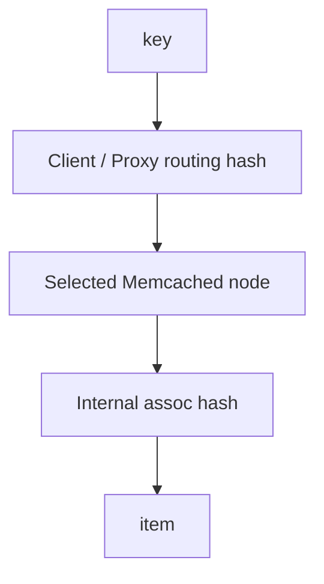

# 第 7 章 · 一致性哈希与分布式 Memcached

> **本章模型：路由与节点自治**  
> 传统 Memcached 把集群路由放到客户端：节点内部只管理自己的 KV。节点成员变化首先是“路由变化”，然后表现为缓存命中变化，而非数据库式数据迁移。

## V2 本章深挖目标

**核心能力：分布式路由。** 重点不是背一致性哈希公式，而是能分析 membership 变化、ring mismatch、node failure、replication trade-off 和现代 proxy。

- **源码锚点：** `客户端路由 / proto_proxy.c / proxy_config.c`
- **面试要求：** 每题至少准备一个“反例/边界条件”和一个“可量化指标”。
- **源码要求：** 遇到函数名要能回答它的输入、持有的锁、Item linked/refcount 状态以及失败路径。
- **生产要求：** 能把内部状态变化连接到 `hit/miss → P99 → origin/CPU/network` 的故障链。

> 完成本章后，不应只会定义术语；应能够解释“为什么这么设计、哪种 workload 下会退化、如何用实验或指标证明”。

## 本章 10 题

| 题目 | 难度 | 重要度 | 必刷 |
|---|---:|---:|:---:|
| [061. 为什么不能简单使用 hash(key) % N？](061.md) | P0 | ★★★★★ | ⭐ |
| [062. 一致性哈希解决什么？](062.md) | P0 | ★★★★★ | ⭐ |
| [063. Virtual Node 是干什么的？](063.md) | P0 | ★★★★☆ |  |
| [064. 一致性哈希是在 Memcached Server 内部完成的吗？](064.md) | P0 | ★★★★★ | ⭐ |
| [065. 加一台 Memcached 后，旧数据会自动迁过去吗？](065.md) | P0 | ★★★★☆ |  |
| [066. 一台 Memcached Node 突然挂了会发生什么？](066.md) | P0 | ★★★★★ | ⭐ |
| [067. Memcached 原生是不是自动复制两份？](067.md) | P0 | ★★★★☆ |  |
| [068. 为什么缓存系统不一定需要强复制？](068.md) | P1 | ★★★☆☆ |  |
| [069. 两个客户端的 Hash Ring 配置不一致会怎样？](069.md) | P1 | ★★★☆☆ |  |
| [070. Built-in Proxy 是否改变了传统模型？](070.md) | P2 | ★★★☆☆ |  |

## 阅读建议

1. 先在不看答案的情况下，用 60-90 秒口述结论。
2. 再看“深度机制”和“源码导航”，把术语落到数据结构/函数。
3. 最后完成“动手验证”，并回答追问。
4. 能白板画出本章 Mermaid 图，并解释每条边的职责，才算真正掌握。
