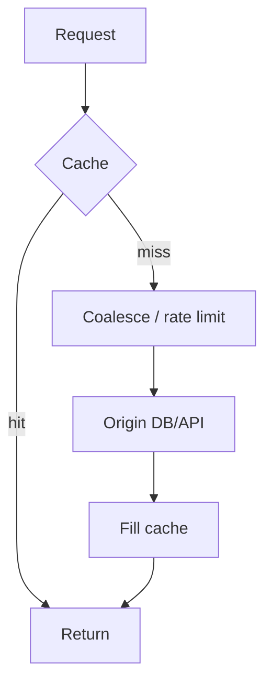

# 第 072 题 · 更新数据库与删除缓存，先做哪个？

> **必刷题** · **P0** · ★★★★★ · 缓存一致性、雪崩、击穿与热点  
> 本文是 PDF 对应题目的扩展版：保留原答案，并补充源码、复杂度、并发不变量、生产实践与实验。

## 题目

**更新数据库与删除缓存，先做哪个？**

## 面试官在考什么

这道题用于判断候选人是否真正理解 **缓存一致性、回源治理、stampede/雪崩/热点**。

面试官通常不会满足于“术语定义”，而会沿着 `更新数据库与删除缓存，先做哪个？` 继续追问到：**状态如何变化、哪个模块拥有这份状态、并发下怎样保持不变量、生产中用什么指标证明判断**。优秀回答应先给 30 秒结论，再主动给出一个反例或故障场景。

## 30-90 秒标准回答

> 经典 Cache Aside 通常先提交 DB，再删除 cache；若反过来，删除后并发 reader 可能回源读旧 DB 并把旧值重新缓存。

面试时建议先讲上面这句话，再根据追问选择展开源码或生产侧影响，不要一开始就陷入函数细节。

## 心智模型

**Cache 失败模型：** Cache miss 是正常语义，但集中 miss 是生产事故来源。所有一致性与容灾设计都要围绕“如何保护 authoritative origin”展开。



## 深度机制

### 1. 任何跨两系统的两步操作仍存在失败窗口。

从“Cache 失败模型”看，这一结论的重点不是记住术语，而是明确职责边界和失败方式。Cache miss 是正常语义，但集中 miss 是生产事故来源。所有一致性与容灾设计都要围绕“如何保护 authoritative origin”展开。
### 2. 可用 CDC/outbox、版本号、短 TTL、重试等加强。

TTL 是逻辑有效期，不等于一个精确计时器任务。过期对象可以在访问、crawler 或内存回收路径上被发现并释放，因此逻辑失效与物理回收不是同一时刻。
### 3. 强一致要求要明确业务容忍度。

从“Cache 失败模型”看，这一结论的重点不是记住术语，而是明确职责边界和失败方式。Cache miss 是正常语义，但集中 miss 是生产事故来源。所有一致性与容灾设计都要围绕“如何保护 authoritative origin”展开。

## 系统不变量

- **不变量 1：** 任何 cache 故障都必须有 origin 保护策略。
- **不变量 2：** 缓存一致性策略不能假设 DB 与 cache 之间存在跨系统原子事务。

这些不变量比记忆具体函数名更稳定。版本升级可能调整代码组织，但破坏这些约束通常意味着正确性或生命周期出现问题。

## 复杂度与性能分析

- 关键不是单次 cache 操作复杂度，而是 miss amplification：一次缓存事件可放大为成千上万次回源。
- 应把 origin 可承受 QPS、回源延迟和并发上限纳入缓存策略。

进一步分析时要区分三个层面：**算法复杂度**（如 Hash 平均 O(1)）、**微架构成本**（cache miss、pointer chasing、cache-line bouncing）和 **系统成本**（RTT、序列化、回源）。高水平回答会主动指出这三者不是一回事。

## 源码导航

> PDF 源码锚点：Basic/Meta Protocol；应用 Cache Aside 与 stale/anti-dogpiling 语义。

建议优先阅读以下 Memcached 1.6.45 文件：

- [`proto_text.c`](https://github.com/memcached/memcached/blob/1.6.45/proto_text.c)
- [`items.c`](https://github.com/memcached/memcached/blob/1.6.45/items.c)
- [`memcached.h`](https://github.com/memcached/memcached/blob/1.6.45/memcached.h)

源码阅读方法：先定位入口函数，再跟踪 **Item 指针如何变化、何时加锁、何时 publication/unlink、何时释放引用**。不要按文件从第一行顺序阅读。

## 工程与生产实践

1. **先确认语义边界：** 本题讨论的是 缓存一致性、回源治理、stampede/雪崩/热点，先区分 server 内部机制、客户端路由和应用回源三层，避免跨层归因。
2. **把关键路径画出来：** 对 `更新数据库与删除缓存，先做哪个？` 至少能指出输入、关键状态、输出以及失败路径；如果涉及 Item，要明确 Hash/LRU/Slab/refcount 中哪些会变化。
3. **用指标证伪：** 定义 maximum_staleness SLA，并用 delete failure rate × TTL 推导潜在 stale exposure。
4. **准备一个故障反例：** writer commit DB 后网络故障未删 cache，旧值继续命中直到 TTL；需要重试 invalidation 或事件驱动补偿。
5. **版本意识：** 本仓库源码锚定 Memcached `1.6.45`；默认参数与现代特性应以该版本官方源码/文档为准。

## 常见易错点

> 不要把某个顺序说成数学上绝对无 race。

再补充两个通用陷阱：

- 把“默认值”说成“协议永远固定值”；例如 item size、线程数等都应区分默认配置与不可变约束。
- 把“当前实现细节”说成“KV cache 必然原理”；面试中应先讲不变量，再讲 Memcached 的具体实现。

## 高频追问

### 追问 1：DB 成功但 delete cache 失败怎么办？

**回答提示：** 先复述边界，再用本题核心机制回答：经典 Cache Aside 通常先提交 DB，再删除 cache；若反过来，删除后并发 reader 可能回源读旧 DB 并把旧值重新缓存。 最后补充一个生产后果或失败场景，避免只给术语。
### 追问 2：延迟双删是否真的严格正确？

**回答提示：** 先复述边界，再用本题核心机制回答：经典 Cache Aside 通常先提交 DB，再删除 cache；若反过来，删除后并发 reader 可能回源读旧 DB 并把旧值重新缓存。 最后补充一个生产后果或失败场景，避免只给术语。

## 动手验证

```text
实验建议：写一个 Cache Aside demo，并加入 singleflight/request coalescing。
让 100 个并发请求同时访问一个刚过期的 key，对比：
1) 无保护时 origin 调用次数；2) 合并请求后 origin 调用次数；3) stale-while-revalidate 下的尾延迟。
```

完成实验后，至少记录：**预期 → 实际 → 为什么 → 对生产设计有什么影响**。只跑通命令而没有解释，不算真正掌握。

## 面试表达模板

> **第一句给结论：** 经典 Cache Aside 通常先提交 DB，再删除 cache；若反过来，删除后并发 reader 可能回源读旧 DB 并把旧值重新缓存。  
> **第二层讲机制：** 用 1 张状态/调用链图说明“谁维护什么状态、何时改变”。  
> **第三层讲边界：** 先 DB 后删仍有“DB commit 成功、delete 失败”的窗口；严格一致需要 CDC/outbox/version 等更强机制。  
> **第四层落生产：** 给出一个指标或算式，例如：定义 maximum_staleness SLA，并用 delete failure rate × TTL 推导潜在 stale exposure。

## 专家级展开（V2）

### A. 从第一性原理推导

常见策略“先 DB 后删 cache”是在两步非事务操作里缩小错误窗口：先删 cache 会允许并发 reader 在 DB 更新前回源旧值并重新填充。

这道题建议使用“**状态 → 所有者 → 转移条件 → 失败后果**”四步法推导，而不是背结论。先确定哪份状态是核心，再问由哪个模块维护，随后说明状态何时迁移，最后指出违反不变量会表现为什么 bug 或性能问题。

### B. 关键源码符号与阅读顺序

- `application transaction + cache delete; Memcached no cross-system transaction`

建议在 `memcached-1.6.45` 源码树中用下面的方式定位，而不是按文件顺序从头读：

```bash
git grep -n "\bapplication\b" -- proto_text.c items.c
```

阅读函数时至少记录 5 个问题：**入参中的 key/hash/item 是谁创建的、当前持有哪些锁、item 是否已 `ITEM_LINKED`、refcount 谁持有、失败路径最终由谁释放资源**。

### C. 边界条件与反例

先 DB 后删仍有“DB commit 成功、delete 失败”的窗口；严格一致需要 CDC/outbox/version 等更强机制。

面试中主动讲边界条件很加分，因为它能证明你区分了“默认实现”“协议语义”“架构经验”和“数学近似”。尤其要避免把平均 O(1)、默认 1MB、client-side hashing 等表述成无条件真理。

### D. 生产故障推演

writer commit DB 后网络故障未删 cache，旧值继续命中直到 TTL；需要重试 invalidation 或事件驱动补偿。

遇到这类问题时，建议把故障链写成：

```text
触发条件 → Memcached 内部状态变化 → HIT/MISS/P99 变化 → origin/网络/CPU 后果 → 保护或恢复动作
```

这样回答能自然从源码层过渡到生产系统，而不是把“源码题”和“系统设计题”割裂开。

### E. 定量分析 / 可验证指标

定义 maximum_staleness SLA，并用 delete failure rate × TTL 推导潜在 stale exposure。

工程上至少给出一个可以**测量或计算**的量。没有数字的“性能更好”“内存更省”“更稳定”通常无法指导容量规划，也很难在故障现场验证。

## 关联题目

- [070. Built-in Proxy 是否改变了传统模型？](../07-consistent-hashing-distributed/070.md)
- [071. 什么是 Cache Aside？](../08-cache-consistency-resilience/071.md)
- [073. 为什么通常推荐 DELETE Cache，而不是 UPDATE Cache？](../08-cache-consistency-resilience/073.md)
- [074. 什么叫缓存穿透？](../08-cache-consistency-resilience/074.md)

## 官方参考

- **S2** [Basic Text Protocol](https://docs.memcached.org/protocols/basic/) — 基础文本协议与命令语义。
- **S3** [Meta Text Protocol](https://docs.memcached.org/protocols/meta/) — Meta 命令、anti-dogpiling、stale、CAS 等高级语义。
- **S15** [FAQ](https://docs.memcached.org/userguide/faq/) — 缓存语义、持久性、复制等常见问题。

---

[← 上一题](../08-cache-consistency-resilience/071.md) | [本章目录](README.md) | [下一题 →](../08-cache-consistency-resilience/073.md)
