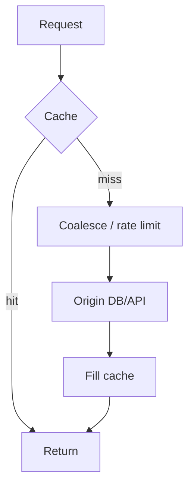

# 第 8 章 · 缓存一致性、雪崩、击穿与热点

> **本章模型：Cache 失败模型**  
> Cache miss 是正常语义，但集中 miss 是生产事故来源。所有一致性与容灾设计都要围绕“如何保护 authoritative origin”展开。

## V2 本章深挖目标

**核心能力：缓存韧性与一致性。** 把 Cache Aside 的读写竞态与穿透、击穿、雪崩、Hot Key 统一成“MISS 如何被放大到 origin”的问题。

- **源码锚点：** `应用层 + Meta/CAS 原语`
- **面试要求：** 每题至少准备一个“反例/边界条件”和一个“可量化指标”。
- **源码要求：** 遇到函数名要能回答它的输入、持有的锁、Item linked/refcount 状态以及失败路径。
- **生产要求：** 能把内部状态变化连接到 `hit/miss → P99 → origin/CPU/network` 的故障链。

> 完成本章后，不应只会定义术语；应能够解释“为什么这么设计、哪种 workload 下会退化、如何用实验或指标证明”。

## 本章 10 题

| 题目 | 难度 | 重要度 | 必刷 |
|---|---:|---:|:---:|
| [071. 什么是 Cache Aside？](071.md) | P0 | ★★★★★ | ⭐ |
| [072. 更新数据库与删除缓存，先做哪个？](072.md) | P0 | ★★★★★ | ⭐ |
| [073. 为什么通常推荐 DELETE Cache，而不是 UPDATE Cache？](073.md) | P1 | ★★★☆☆ |  |
| [074. 什么叫缓存穿透？](074.md) | P0 | ★★★★☆ |  |
| [075. 什么叫缓存击穿 / Stampede？](075.md) | P0 | ★★★★★ | ⭐ |
| [076. 什么叫缓存雪崩？](076.md) | P0 | ★★★★★ | ⭐ |
| [077. Hot Key 有什么危险？](077.md) | P0 | ★★★★★ | ⭐ |
| [078. CAS 能不能解决缓存与数据库的强一致性？](078.md) | P1 | ★★★☆☆ |  |
| [079. incr/decr 为什么适合做轻量计数器？](079.md) | P1 | ★★★☆☆ |  |
| [080. Session 能不能存在 Memcached？](080.md) | P0 | ★★★★☆ |  |

## 阅读建议

1. 先在不看答案的情况下，用 60-90 秒口述结论。
2. 再看“深度机制”和“源码导航”，把术语落到数据结构/函数。
3. 最后完成“动手验证”，并回答追问。
4. 能白板画出本章 Mermaid 图，并解释每条边的职责，才算真正掌握。
