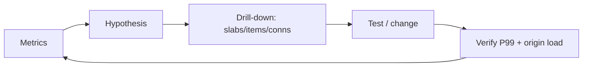

# 第 089 题 · Memcached 在 NUMA 机器上有什么问题？

> **P2** · ★★★☆☆ · 监控、容量规划与故障诊断  
> 本文是 PDF 对应题目的扩展版：保留原答案，并补充源码、复杂度、并发不变量、生产实践与实验。

## 题目

**Memcached 在 NUMA 机器上有什么问题？**

## 面试官在考什么

这道题用于判断候选人是否真正理解 **可观测性、容量规划、故障排查与 OS/硬件边界**。

面试官通常不会满足于“术语定义”，而会沿着 `Memcached 在 NUMA 机器上有什么问题？` 继续追问到：**状态如何变化、哪个模块拥有这份状态、并发下怎样保持不变量、生产中用什么指标证明判断**。优秀回答应先给 30 秒结论，再主动给出一个反例或故障场景。

## 30-90 秒标准回答

> worker 访问远端 NUMA 内存会增加 latency 和 cache coherence 开销；极端低延迟场景可按 NUMA node 绑定进程、CPU 与内存。

面试时建议先讲上面这句话，再根据追问选择展开源码或生产侧影响，不要一开始就陷入函数细节。

## 心智模型

**可观测性闭环：** 不能只看 hit rate。必须把请求、容量、slab class、eviction、连接、CPU/网络和 origin 压力串成因果链。



## 深度机制

### 1. 单大实例并不总优于每 NUMA 一实例。

NUMA 下远端内存访问会提高延迟并增加不可预测性；极限性能场景常通过绑核/绑内存或按 NUMA node 拆实例减少跨节点访问。
### 2. NIC affinity、IRQ 也会影响尾延迟。

从“可观测性闭环”看，这一结论的重点不是记住术语，而是明确职责边界和失败方式。不能只看 hit rate。必须把请求、容量、slab class、eviction、连接、CPU/网络和 origin 压力串成因果链。
### 3. 必须用实际 workload benchmark。

从“可观测性闭环”看，这一结论的重点不是记住术语，而是明确职责边界和失败方式。不能只看 hit rate。必须把请求、容量、slab class、eviction、连接、CPU/网络和 origin 压力串成因果链。

## 系统不变量

- **不变量 1：** 监控结论必须能从现象追到具体资源/路径。
- **不变量 2：** 扩容或参数变更后要用命中率、P99 与 origin load 验证效果。

这些不变量比记忆具体函数名更稳定。版本升级可能调整代码组织，但破坏这些约束通常意味着正确性或生命周期出现问题。

## 复杂度与性能分析

- 任何指标都应看 rate/delta 而不是孤立累计值，并结合 P50/P95/P99 与 origin 指标。
- 容量诊断要按 slab class、连接和节点维度下钻，避免用全局平均掩盖局部瓶颈。

进一步分析时要区分三个层面：**算法复杂度**（如 Hash 平均 O(1)）、**微架构成本**（cache miss、pointer chasing、cache-line bouncing）和 **系统成本**（RTT、序列化、回源）。高水平回答会主动指出这三者不是一回事。

## 源码导航


建议优先阅读以下 Memcached 1.6.45 文件：

- [`items.c`](https://github.com/memcached/memcached/blob/1.6.45/items.c)
- [`slabs.c`](https://github.com/memcached/memcached/blob/1.6.45/slabs.c)
- [`memcached.c`](https://github.com/memcached/memcached/blob/1.6.45/memcached.c)

源码阅读方法：先定位入口函数，再跟踪 **Item 指针如何变化、何时加锁、何时 publication/unlink、何时释放引用**。不要按文件从第一行顺序阅读。

## 工程与生产实践

1. **先确认语义边界：** 本题讨论的是 可观测性、容量规划、故障排查与 OS/硬件边界，先区分 server 内部机制、客户端路由和应用回源三层，避免跨层归因。
2. **把关键路径画出来：** 对 `Memcached 在 NUMA 机器上有什么问题？` 至少能指出输入、关键状态、输出以及失败路径；如果涉及 Item，要明确 Hash/LRU/Slab/refcount 中哪些会变化。
3. **用指标证伪：** 用 numastat/perf mem（平台支持时）看 remote access，结合线程/内存 binding A/B test。
4. **准备一个故障反例：** 双路机器单实例随机跨 NUMA，P99 比两个按 NUMA 绑定的实例高；但拆实例后客户端路由和容量也要调整。
5. **版本意识：** 本仓库源码锚定 Memcached `1.6.45`；默认参数与现代特性应以该版本官方源码/文档为准。

## 常见易错点

> NUMA 是高阶性能调优题，不应在小规模系统过度优化。

再补充两个通用陷阱：

- 把“默认值”说成“协议永远固定值”；例如 item size、线程数等都应区分默认配置与不可变约束。
- 把“当前实现细节”说成“KV cache 必然原理”；面试中应先讲不变量，再讲 Memcached 的具体实现。

## 高频追问

### 追问 1：numactl 如何验证改善？

**回答提示：** 通过绑核/绑内存、减少跨 socket 共享，或按 NUMA node 运行实例来降低远端内存访问。
### 追问 2：多实例会怎样影响 consistent hash？

**回答提示：** 先复述边界，再用本题核心机制回答：worker 访问远端 NUMA 内存会增加 latency 和 cache coherence 开销；极端低延迟场景可按 NUMA node 绑定进程、CPU 与内存。 最后补充一个生产后果或失败场景，避免只给术语。

## 动手验证

```bash
printf "stats\r\nstats settings\r\nstats slabs\r\nstats items\r\n" | nc 127.0.0.1 11211
```

每隔固定时间采样一次并计算 delta/rate。不要只截一张累计值快照；把 `get_misses`、`evictions`、P99 和数据库 QPS 放在同一时间轴。

完成实验后，至少记录：**预期 → 实际 → 为什么 → 对生产设计有什么影响**。只跑通命令而没有解释，不算真正掌握。

## 面试表达模板

> **第一句给结论：** worker 访问远端 NUMA 内存会增加 latency 和 cache coherence 开销；极端低延迟场景可按 NUMA node 绑定进程、CPU 与内存。  
> **第二层讲机制：** 用 1 张状态/调用链图说明“谁维护什么状态、何时改变”。  
> **第三层讲边界：** NUMA tuning 不是所有场景都收益；错误 pinning 可能让单 socket CPU/NIC/内存不均。  
> **第四层落生产：** 给出一个指标或算式，例如：用 numastat/perf mem（平台支持时）看 remote access，结合线程/内存 binding A/B test。

## 专家级展开（V2）

### A. 从第一性原理推导

NUMA 下“内存本地性”影响延迟：worker 在 socket A 访问 socket B 的内存会产生远程访问；高 QPS 指针密集 workload 对此很敏感。

这道题建议使用“**状态 → 所有者 → 转移条件 → 失败后果**”四步法推导，而不是背结论。先确定哪份状态是核心，再问由哪个模块维护，随后说明状态何时迁移，最后指出违反不变量会表现为什么 bug 或性能问题。

### B. 关键源码符号与阅读顺序

- `deployment/OS level; Memcached threads + slab memory`

建议在 `memcached-1.6.45` 源码树中用下面的方式定位，而不是按文件顺序从头读：

```bash
git grep -n "\bdeployment\b" -- stats_prefix.c items.c slabs.c memcached.c
```

阅读函数时至少记录 5 个问题：**入参中的 key/hash/item 是谁创建的、当前持有哪些锁、item 是否已 `ITEM_LINKED`、refcount 谁持有、失败路径最终由谁释放资源**。

### C. 边界条件与反例

NUMA tuning 不是所有场景都收益；错误 pinning 可能让单 socket CPU/NIC/内存不均。

面试中主动讲边界条件很加分，因为它能证明你区分了“默认实现”“协议语义”“架构经验”和“数学近似”。尤其要避免把平均 O(1)、默认 1MB、client-side hashing 等表述成无条件真理。

### D. 生产故障推演

双路机器单实例随机跨 NUMA，P99 比两个按 NUMA 绑定的实例高；但拆实例后客户端路由和容量也要调整。

遇到这类问题时，建议把故障链写成：

```text
触发条件 → Memcached 内部状态变化 → HIT/MISS/P99 变化 → origin/网络/CPU 后果 → 保护或恢复动作
```

这样回答能自然从源码层过渡到生产系统，而不是把“源码题”和“系统设计题”割裂开。

### E. 定量分析 / 可验证指标

用 numastat/perf mem（平台支持时）看 remote access，结合线程/内存 binding A/B test。

工程上至少给出一个可以**测量或计算**的量。没有数字的“性能更好”“内存更省”“更稳定”通常无法指导容量规划，也很难在故障现场验证。

## 关联题目

- [087. 为什么应该使用 Persistent Connections？](../09-observability-capacity-troubleshooting/087.md)
- [088. stats slabs 能帮助判断什么？](../09-observability-capacity-troubleshooting/088.md)
- [090. 为什么 Swap 对 Memcached 特别危险？](../09-observability-capacity-troubleshooting/090.md)
- [091. Extstore 是什么？Memcached 不是纯 RAM 吗？](../10-advanced-source-system-design/091.md)

## 官方参考

- **S11** [Server Maintenance](https://docs.memcached.org/serverguide/maintenance/) — hit rate、eviction、slab 监控与维护。
- **S12** [Server Configuring](https://docs.memcached.org/serverguide/configuring/) — 内存、连接、线程、item size、运行配置。
- **S17** [Performance and Efficiency](https://docs.memcached.org/serverguide/performance/) — 内存占用、回收与性能行为。

---

[← 上一题](../09-observability-capacity-troubleshooting/088.md) | [本章目录](README.md) | [下一题 →](../09-observability-capacity-troubleshooting/090.md)
