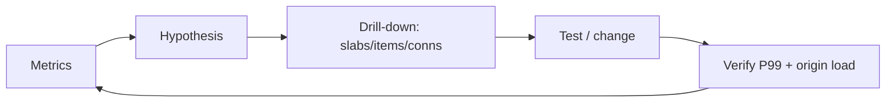

# 第 9 章 · 监控、容量规划与故障诊断

> **本章模型：可观测性闭环**  
> 不能只看 hit rate。必须把请求、容量、slab class、eviction、连接、CPU/网络和 origin 压力串成因果链。

## V2 本章深挖目标

**核心能力：观测与诊断。** 任何结论都必须能从 metrics 证伪：全局 hit rate 之外还要看 per-class eviction、tail age、connections、RSS、NUMA/swap。

- **源码锚点：** `stats / items.c / slabs.c / OS metrics`
- **面试要求：** 每题至少准备一个“反例/边界条件”和一个“可量化指标”。
- **源码要求：** 遇到函数名要能回答它的输入、持有的锁、Item linked/refcount 状态以及失败路径。
- **生产要求：** 能把内部状态变化连接到 `hit/miss → P99 → origin/CPU/network` 的故障链。

> 完成本章后，不应只会定义术语；应能够解释“为什么这么设计、哪种 workload 下会退化、如何用实验或指标证明”。

## 本章 10 题

| 题目 | 难度 | 重要度 | 必刷 |
|---|---:|---:|:---:|
| [081. 生产 Memcached 第一眼看哪些指标？](081.md) | P0 | ★★★★★ | ⭐ |
| [082. Hit Rate 怎么计算？](082.md) | P0 | ★★★★☆ |  |
| [083. evictions 持续增长说明什么？](083.md) | P0 | ★★★★★ | ⭐ |
| [084. 为什么 Item 过期后 curr_items 可能没有立即下降？](084.md) | P1 | ★★★☆☆ |  |
| [085. get_misses 突然暴涨，你怎么排查？](085.md) | P1 | ★★★☆☆ |  |
| [086. listen_disabled_num 很高说明什么？](086.md) | P1 | ★★★☆☆ |  |
| [087. 为什么应该使用 Persistent Connections？](087.md) | P0 | ★★★★☆ |  |
| [088. stats slabs 能帮助判断什么？](088.md) | P1 | ★★★☆☆ |  |
| [089. Memcached 在 NUMA 机器上有什么问题？](089.md) | P2 | ★★★☆☆ |  |
| [090. 为什么 Swap 对 Memcached 特别危险？](090.md) | P0 | ★★★★★ | ⭐ |

## 阅读建议

1. 先在不看答案的情况下，用 60-90 秒口述结论。
2. 再看“深度机制”和“源码导航”，把术语落到数据结构/函数。
3. 最后完成“动手验证”，并回答追问。
4. 能白板画出本章 Mermaid 图，并解释每条边的职责，才算真正掌握。
