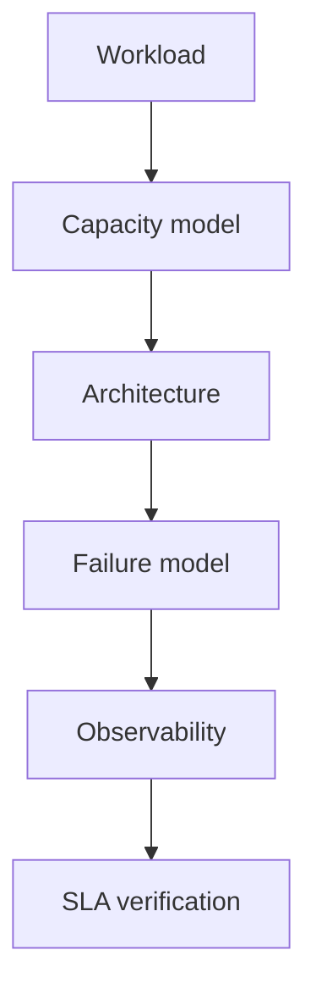

# 第 100 题 · 如果让你现场实现一个 Mini-Memcached，你怎么拆？

> **必刷题** · **P0** · ★★★★★ · 高级特性、源码与系统设计  
> 本文是 PDF 对应题目的扩展版：保留原答案，并补充源码、复杂度、并发不变量、生产实践与实验。

## 题目

**如果让你现场实现一个 Mini-Memcached，你怎么拆？**

## 面试官在考什么

这道题用于判断候选人是否真正理解 **Extstore、Warm Restart、Meta/Proxy 与系统设计**。

面试官通常不会满足于“术语定义”，而会沿着 `如果让你现场实现一个 Mini-Memcached，你怎么拆？` 继续追问到：**状态如何变化、哪个模块拥有这份状态、并发下怎样保持不变量、生产中用什么指标证明判断**。优秀回答应先给 30 秒结论，再主动给出一个反例或故障场景。

## 30-90 秒标准回答

> 按 7 个阶段：HashMap GET/SET/DELETE → Item+TTL → 自研 Hash collision → LRU → Slab pool → refcount/locks → TCP event loop/protocol；每阶段用测试维护不变量。

面试时建议先讲上面这句话，再根据追问选择展开源码或生产侧影响，不要一开始就陷入函数细节。

## 心智模型

**从机制到架构：** 高级特性不是功能清单：Extstore、Meta、Warm Restart、Proxy 分别解决容量、协议语义、重启冲击和路由控制面问题，系统设计要量化代价。



## 深度机制

### 1. 先保证语义，再做内存池和并发。

从“从机制到架构”看，这一结论的重点不是记住术语，而是明确职责边界和失败方式。高级特性不是功能清单：Extstore、Meta、Warm Restart、Proxy 分别解决容量、协议语义、重启冲击和路由控制面问题，系统设计要量化代价。
### 2. Item 同时有 h_next 与 lru_prev/lru_next。

`h_next` 属于哈希冲突链，和 LRU 的 `next/prev` 是两套不同索引；同一个 Item 同时被多种数据结构引用，是源码阅读的关键。
### 3. SET 使用 construct-before-publish，DELETE 使用 unlink-before-free。

从“从机制到架构”看，这一结论的重点不是记住术语，而是明确职责边界和失败方式。高级特性不是功能清单：Extstore、Meta、Warm Restart、Proxy 分别解决容量、协议语义、重启冲击和路由控制面问题，系统设计要量化代价。
### 4. 实现路线

从“从机制到架构”看，这一结论的重点不是记住术语，而是明确职责边界和失败方式。高级特性不是功能清单：Extstore、Meta、Warm Restart、Proxy 分别解决容量、协议语义、重启冲击和路由控制面问题，系统设计要量化代价。
### 5. 第 1-3 阶段只建立正确语义：GET/SET/DELETE、TTL、Hash collision；第 4-5 阶段引入 LRU 和 Slab，第一次出现“一个对象属于多结构”的系统不变量。

Slab 的设计核心是 size class + page + fixed-size chunk。它通过复用 chunk 避免在请求热路径频繁进入通用 allocator，但也意味着对象尺寸分布会直接决定内存利用率。
### 6. 第 6 阶段加入 refcount 和锁，重点测试 GET 与 DELETE/SET 并发；第 7 阶段再加 TCP/event loop，把网络状态机与 KV core 分离。

refcount 解决的是对象“仍被谁使用”的问题。一个 item 可以已经从 Hash/LRU 逻辑删除，但只要其他线程还持有引用，就不能把底层 chunk 重新分配。
### 7. 最关键的两个工程约束：SET 必须 construct-before-publish；DELETE 必须 unlink-before-free。

从“从机制到架构”看，这一结论的重点不是记住术语，而是明确职责边界和失败方式。高级特性不是功能清单：Extstore、Meta、Warm Restart、Proxy 分别解决容量、协议语义、重启冲击和路由控制面问题，系统设计要量化代价。

## 系统不变量

- **不变量 1：** 高级特性不能改变 Cache 可丢、可重建这一基本语义。
- **不变量 2：** 容量与容灾设计必须在 N+1/节点故障时仍满足 origin 与 SLA 约束。

这些不变量比记忆具体函数名更稳定。版本升级可能调整代码组织，但破坏这些约束通常意味着正确性或生命周期出现问题。

## 复杂度与性能分析

- 高级特性要量化收益和新增代价：网络跳数、SSD I/O、元数据 RAM、代理容量或一致性窗口。
- 系统设计节点数应取 RAM/CPU/network/P99 四类约束中的最大值，并加入故障 headroom。

进一步分析时要区分三个层面：**算法复杂度**（如 Hash 平均 O(1)）、**微架构成本**（cache miss、pointer chasing、cache-line bouncing）和 **系统成本**（RTT、序列化、回源）。高水平回答会主动指出这三者不是一回事。

## 源码导航

> PDF 源码锚点：Meta、Extstore、Proxy 文档；结合前九章做系统设计。

建议优先阅读以下 Memcached 1.6.45 文件：

- [`storage.c`](https://github.com/memcached/memcached/blob/1.6.45/storage.c)
- [`extstore.c`](https://github.com/memcached/memcached/blob/1.6.45/extstore.c)
- [`proto_proxy.c`](https://github.com/memcached/memcached/blob/1.6.45/proto_proxy.c)
- [`proxy_config.c`](https://github.com/memcached/memcached/blob/1.6.45/proxy_config.c)
- [`proto_text.c`](https://github.com/memcached/memcached/blob/1.6.45/proto_text.c)

源码阅读方法：先定位入口函数，再跟踪 **Item 指针如何变化、何时加锁、何时 publication/unlink、何时释放引用**。不要按文件从第一行顺序阅读。

## 工程与生产实践

1. **先确认语义边界：** 本题讨论的是 Extstore、Warm Restart、Meta/Proxy 与系统设计，先区分 server 内部机制、客户端路由和应用回源三层，避免跨层归因。
2. **把关键路径画出来：** 对 `如果让你现场实现一个 Mini-Memcached，你怎么拆？` 至少能指出输入、关键状态、输出以及失败路径；如果涉及 Item，要明确 Hash/LRU/Slab/refcount 中哪些会变化。
3. **用指标证伪：** 每阶段定义验收：Hash 随机对拍、LRU eviction 顺序、Slab class/fragmentation、并发线性化、网络协议正确性和压测 P99。
4. **准备一个故障反例：** 如果先写 TCP/多线程再补生命周期，很容易遇到 UAF、锁序和测试困难；模块化构建可让每阶段用 reference model 对拍。
5. **版本意识：** 本仓库源码锚定 Memcached `1.6.45`；默认参数与现代特性应以该版本官方源码/文档为准。

## 常见易错点

> 这是把 100 题知识真正闭环成工程能力的终极题。

再补充两个通用陷阱：

- 把“默认值”说成“协议永远固定值”；例如 item size、线程数等都应区分默认配置与不可变约束。
- 把“当前实现细节”说成“KV cache 必然原理”；面试中应先讲不变量，再讲 Memcached 的具体实现。

## 高频追问

### 追问 1：如何测试并发 use-after-free？

**回答提示：** 先复述边界，再用本题核心机制回答：按 7 个阶段：HashMap GET/SET/DELETE → Item+TTL → 自研 Hash collision → LRU → Slab pool → refcount/locks → TCP event loop/protocol；每阶段用测试维护不变量。 最后补充一个生产后果或失败场景，避免只给术语。
### 追问 2：如何模拟 slab imbalance？

**回答提示：** 先复述边界，再用本题核心机制回答：按 7 个阶段：HashMap GET/SET/DELETE → Item+TTL → 自研 Hash collision → LRU → Slab pool → refcount/locks → TCP event loop/protocol；每阶段用测试维护不变量。 最后补充一个生产后果或失败场景，避免只给术语。

## 动手验证

```text
系统设计练习：给定 1,000,000 QPS、95% GET、平均 value 2 KiB、目标 hit rate 98%、P99 < 2 ms，
先列出仍缺失的输入，再分别计算 RAM、CPU、network、origin miss capacity 的节点下界；
最后做单节点故障和 Hot Key 两个故障注入。
```

完成实验后，至少记录：**预期 → 实际 → 为什么 → 对生产设计有什么影响**。只跑通命令而没有解释，不算真正掌握。

## 面试表达模板

> **第一句给结论：** 按 7 个阶段：HashMap GET/SET/DELETE → Item+TTL → 自研 Hash collision → LRU → Slab pool → refcount/locks → TCP event loop/protocol；每阶段用测试维护不变量。  
> **第二层讲机制：** 用 1 张状态/调用链图说明“谁维护什么状态、何时改变”。  
> **第三层讲边界：** 面试不需要复制 Memcached 全源码；更重要的是说明为什么先实现地址索引，再生命周期，再内存池，再并发和网络。  
> **第四层落生产：** 给出一个指标或算式，例如：每阶段定义验收：Hash 随机对拍、LRU eviction 顺序、Slab class/fragmentation、并发线性化、网络协议正确性和压测 P99。

## 专家级展开（V2）

### A. 从第一性原理推导

现场实现应按依赖顺序递增复杂度：Hash KV→Item+TTL→自建 Hash collision→LRU→Slab→refcount/locks→TCP event loop。每阶段都要有独立不变量和测试，避免一次写成不可验证的大系统。

这道题建议使用“**状态 → 所有者 → 转移条件 → 失败后果**”四步法推导，而不是背结论。先确定哪份状态是核心，再问由哪个模块维护，随后说明状态何时迁移，最后指出违反不变量会表现为什么 bug 或性能问题。

### B. 关键源码符号与阅读顺序

- `对照 struct item`
- `assoc.c`
- `items.c`
- `slabs.c`
- `thread.c`
- `memcached.c`

建议在 `memcached-1.6.45` 源码树中用下面的方式定位，而不是按文件顺序从头读：

```bash
git grep -n "\bassoc\b" -- storage.c extstore.c proto_proxy.c proxy_config.c proto_text.c
git grep -n "\bitems\b" -- storage.c extstore.c proto_proxy.c proxy_config.c proto_text.c
git grep -n "\bslabs\b" -- storage.c extstore.c proto_proxy.c proxy_config.c proto_text.c
git grep -n "\bthread\b" -- storage.c extstore.c proto_proxy.c proxy_config.c proto_text.c
git grep -n "\bmemcached\b" -- storage.c extstore.c proto_proxy.c proxy_config.c proto_text.c
```

阅读函数时至少记录 5 个问题：**入参中的 key/hash/item 是谁创建的、当前持有哪些锁、item 是否已 `ITEM_LINKED`、refcount 谁持有、失败路径最终由谁释放资源**。

### C. 边界条件与反例

面试不需要复制 Memcached 全源码；更重要的是说明为什么先实现地址索引，再生命周期，再内存池，再并发和网络。

面试中主动讲边界条件很加分，因为它能证明你区分了“默认实现”“协议语义”“架构经验”和“数学近似”。尤其要避免把平均 O(1)、默认 1MB、client-side hashing 等表述成无条件真理。

### D. 生产故障推演

如果先写 TCP/多线程再补生命周期，很容易遇到 UAF、锁序和测试困难；模块化构建可让每阶段用 reference model 对拍。

遇到这类问题时，建议把故障链写成：

```text
触发条件 → Memcached 内部状态变化 → HIT/MISS/P99 变化 → origin/网络/CPU 后果 → 保护或恢复动作
```

这样回答能自然从源码层过渡到生产系统，而不是把“源码题”和“系统设计题”割裂开。

### E. 定量分析 / 可验证指标

每阶段定义验收：Hash 随机对拍、LRU eviction 顺序、Slab class/fragmentation、并发线性化、网络协议正确性和压测 P99。

工程上至少给出一个可以**测量或计算**的量。没有数字的“性能更好”“内存更省”“更稳定”通常无法指导容量规划，也很难在故障现场验证。

## 关联题目

- [098. 一个 Node 故障后，怎样避免数据库被 MISS 打死？](../10-advanced-source-system-design/098.md)
- [099. 什么场景下会明确选择 Memcached，而不是 Redis？](../10-advanced-source-system-design/099.md)

## 官方参考

- **S3** [Meta Text Protocol](https://docs.memcached.org/protocols/meta/) — Meta 命令、anti-dogpiling、stale、CAS 等高级语义。
- **S13** [Flash Storage / Extstore](https://docs.memcached.org/features/flashstorage/) — SSD/NVMe 扩展容量模型。
- **S14** [Built-in Proxy](https://docs.memcached.org/features/proxy/) — 1.6.23+ 内置代理、pool、route 与一致性路由。
- **S15** [FAQ](https://docs.memcached.org/userguide/faq/) — 缓存语义、持久性、复制等常见问题。
- **S16** [Memcached 1.6.45 Release Notes](https://github.com/memcached/memcached/wiki/ReleaseNotes1645) — 2026-07-09 稳定版说明。

---

[← 上一题](../10-advanced-source-system-design/099.md) | [本章目录](README.md) | 下一题：无 →
