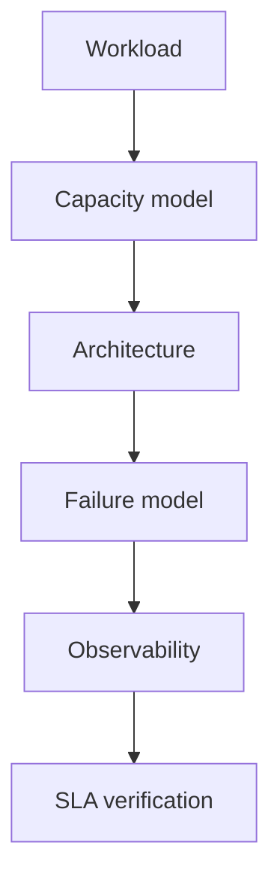

# 第 10 章 · 高级特性、源码与系统设计

> **本章模型：从机制到架构**  
> 高级特性不是功能清单：Extstore、Meta、Warm Restart、Proxy 分别解决容量、协议语义、重启冲击和路由控制面问题，系统设计要量化代价。

## V2 本章深挖目标

**核心能力：高级特性与系统设计。** 把 Extstore、Warm Restart、Meta、Proxy 放入容量/恢复/协议/控制面四类问题，再完成百万 QPS 与节点故障容量推导。

- **源码锚点：** `storage.c / extstore.c / proto_proxy.c / Meta protocol`
- **面试要求：** 每题至少准备一个“反例/边界条件”和一个“可量化指标”。
- **源码要求：** 遇到函数名要能回答它的输入、持有的锁、Item linked/refcount 状态以及失败路径。
- **生产要求：** 能把内部状态变化连接到 `hit/miss → P99 → origin/CPU/network` 的故障链。

> 完成本章后，不应只会定义术语；应能够解释“为什么这么设计、哪种 workload 下会退化、如何用实验或指标证明”。

## 本章 10 题

| 题目 | 难度 | 重要度 | 必刷 |
|---|---:|---:|:---:|
| [091. Extstore 是什么？Memcached 不是纯 RAM 吗？](091.md) | P2 | ★★★☆☆ |  |
| [092. Extstore 为什么仍需要大量 RAM？](092.md) | P2 | ★★★☆☆ |  |
| [093. 什么是 Warm Restart？](093.md) | P2 | ★★★☆☆ |  |
| [094. Meta Protocol 怎么实现 stale-while-revalidate？](094.md) | P2 | ★★★☆☆ |  |
| [095. Meta CAS Override 有什么用途？](095.md) | P2 | ★★★☆☆ |  |
| [096. Built-in Proxy 为什么值得关注？](096.md) | P2 | ★★★☆☆ |  |
| [097. 让你设计 100 万 QPS 的 Memcached 集群，怎么回答？](097.md) | P0 | ★★★★★ | ⭐ |
| [098. 一个 Node 故障后，怎样避免数据库被 MISS 打死？](098.md) | P0 | ★★★★★ | ⭐ |
| [099. 什么场景下会明确选择 Memcached，而不是 Redis？](099.md) | P1 | ★★★☆☆ |  |
| [100. 如果让你现场实现一个 Mini-Memcached，你怎么拆？](100.md) | P0 | ★★★★★ | ⭐ |

## 阅读建议

1. 先在不看答案的情况下，用 60-90 秒口述结论。
2. 再看“深度机制”和“源码导航”，把术语落到数据结构/函数。
3. 最后完成“动手验证”，并回答追问。
4. 能白板画出本章 Mermaid 图，并解释每条边的职责，才算真正掌握。
