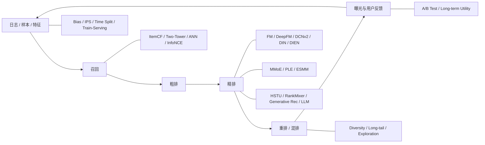

# 知识地图

推荐系统面试不应被记成 100 个孤立问题，而应形成一张“候选生成 → 排序 → 列表决策 → 数据/实验 → 前沿 Scaling”的知识图。

## 五条主线

1. **效率主线**：全库不可精排 → 多阶段 → 双塔/ANN → 粗排 → GPU-friendly ranking。
2. **表示主线**：CF → embedding → target-aware interest → long sequence → generative sequence modeling。
3. **监督主线**：点击/转化/时长 → 负采样 → 多任务 → debias → causal online validation。
4. **产品主线**：CTR → 多目标 utility → diversity/long-tail → retention/生态。
5. **Scaling 主线**：模型更大并不自动更好，必须同时满足 QPS、P99、成本和数据规模。
