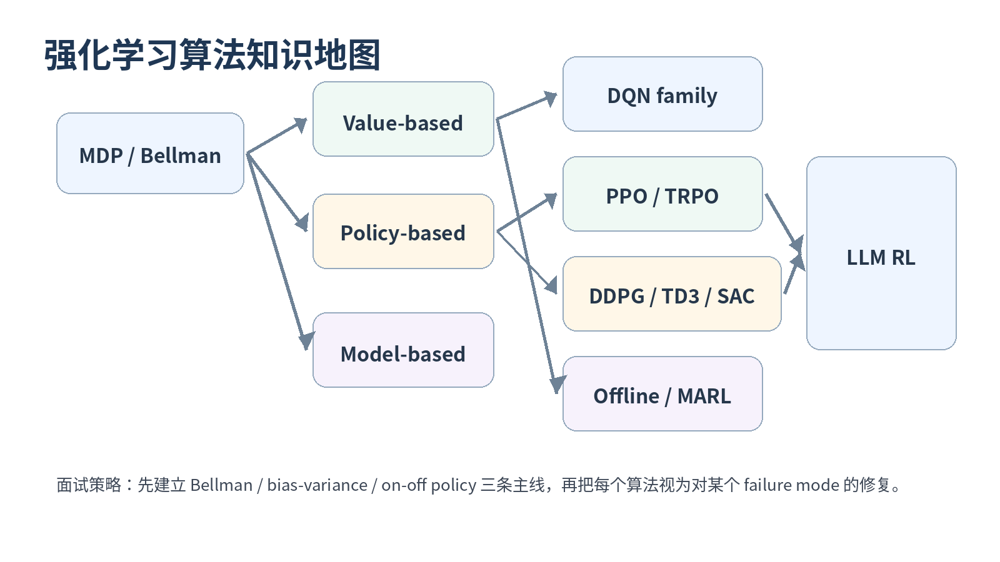
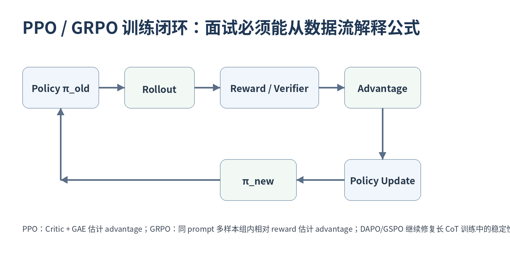
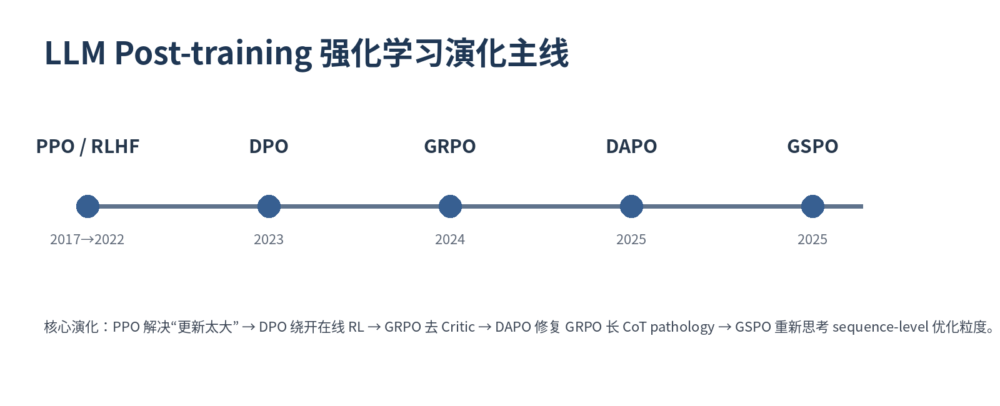

# 强化学习算法岗面试宝典 · 100 题 · 2026

> 从 MDP / Bellman 到 PPO / GRPO / DAPO / GSPO：面向游戏 RL、机器人控制、Offline RL、LLM Post-training 与 RL Infra 的题目驱动式面试仓库。



## 这个 Repo 与 PDF 的关系

- [`book/强化学习算法岗面试宝典_100题_2026版.pdf`](book/强化学习算法岗面试宝典_100题_2026版.pdf) 是原始 114 页专业版 PDF。
- `questions/` 将 **Q001-Q100 一题一 Markdown**，保留 PDF 的题号、原始 30 秒回答、深入解析、公式、追问、易错点与评分标准。
- 每题新增 **第一原则深化、数学推导抓手、工程检查点、failure mode、追问参考答法、90 秒专业回答、最小可验证实验、Primary Source 精读建议**，使 GitHub v2 明显比 PDF 更适合长期学习、面试和工程复盘。
- [`book/pdf-extracted-text.txt`](book/pdf-extracted-text.txt) 保存 PDF 文本抽取快照，便于审计“Repo 是否覆盖原书内容”。

## v2 Professional Expansion

本版不是简单“加长”：100 道题都增加了**问题特异**的专业深化。统一要求是：

- 从 failure mode 解释算法设计，而不是背名词；
- 写清期望分布、bootstrap/target、stop-gradient 和 mask；
- 能把 bias / variance / distribution shift / optimization instability 对应到公式；
- 能给出日志指标和最小可验证实验；
- 90 秒回答必须包含“结论 → 公式 → tradeoff → 工程验证”。

详见 [REPO-STATS.md](REPO-STATS.md)。

## 7 大章节

- [第一章 MDP / Bellman / DP / MC / TD](questions/01-foundations/README.md) — Q001-Q015
- [第二章 Q-learning / DQN 系列](questions/02-value-based/README.md) — Q016-Q028
- [第三章 Policy Gradient / Actor-Critic / PPO](questions/03-policy-gradient-ppo/README.md) — Q029-Q048
- [第四章 DDPG / TD3 / SAC 连续控制](questions/04-continuous-control/README.md) — Q049-Q058
- [第五章 Offline RL / Model-based / MARL / Sim2Real](questions/05-offline-model-marl-robotics/README.md) — Q059-Q070
- [第六章 RLHF / DPO / GRPO / DAPO / GSPO](questions/06-llm-post-training-rl/README.md) — Q071-Q090
- [第七章 Debug / RL Infra / System Design](questions/07-debug-infra-system-design/README.md) — Q091-Q100

## 三条总主线

1. **Bellman / Bootstrap**：价值从哪里来，误差如何传播？
2. **Bias-Variance / Credit Assignment**：为什么需要 MC、TD、GAE、Critic、Group Baseline？
3. **Distribution Shift / Policy Update**：为什么需要 Replay、Importance Sampling、Trust Region、KL、Conservative Objective？



## 2026 LLM-RL 演化



重点阅读：

- [LLM Post-training / Reasoning RL Top 15](study-paths/llm-rl-top15.md)
- [Q081 GRPO 为什么被提出？](questions/06-llm-post-training-rl/Q081-grpo-vs-ppo.md)
- [Q085 DAPO](questions/06-llm-post-training-rl/Q085-dapo.md)
- [Q086 GSPO](questions/06-llm-post-training-rl/Q086-gspo.md)
- [Q095 Rollout System](questions/07-debug-infra-system-design/Q095-rollout-system.md)
- [Q099 手撕 GRPO](questions/07-debug-infra-system-design/Q099-implement-grpo.md)

## 学习路径

- [7 天冲刺](study-paths/7-day-crash-course.md)
- [传统强化学习 Top 20](study-paths/traditional-rl-top20.md)
- [LLM-RL Top 15](study-paths/llm-rl-top15.md)
- [手撕实现 Top 10](study-paths/coding-top10.md)

## 速查资料

- [公式总表](references/formula-sheet.md)
- [算法选型](references/algorithm-selection.md)
- [术语表](references/glossary.md)
- [Primary Papers](references/papers.md)
- [公开面经口径](references/interview-sources.md)
- [代码骨架](code/README.md)

## 全部 100 题

| 题号 | 题目 | 题型 | 频率 | 难度 |
|---|---|---|---:|---:|
| [Q001](questions/01-foundations/Q001-mdp-five-tuple.md) | 什么是 MDP？五元组分别代表什么？ | 基础母题 | ★★★★★ | ★★☆☆☆ |
| [Q002](questions/01-foundations/Q002-markov-property.md) | 一句话解释 Markov Property。 | 公开面经母题 | ★★★★★ | ★★☆☆☆ |
| [Q003](questions/01-foundations/Q003-discount-factor.md) | 为什么 Return 需要折扣因子 γ？ | 基础扩展 | ★★★★☆ | ★★☆☆☆ |
| [Q004](questions/01-foundations/Q004-value-q-advantage.md) | V(s)、Q(s,a)、A(s,a) 有什么关系？ | 基础母题 | ★★★★★ | ★★☆☆☆ |
| [Q005](questions/01-foundations/Q005-bellman-expectation.md) | 推导 Bellman Expectation Equation。 | 核心推导 | ★★★★★ | ★★★☆☆ |
| [Q006](questions/01-foundations/Q006-bellman-optimality.md) | Bellman Optimality 与 Bellman Expectation 有什么区别？ | 基础扩展 | ★★★★☆ | ★★★☆☆ |
| [Q007](questions/01-foundations/Q007-dp-mc-td.md) | Dynamic Programming、Monte Carlo、TD 的区别？ | 公开面经母题 | ★★★★★ | ★★★☆☆ |
| [Q008](questions/01-foundations/Q008-mc-vs-td.md) | MC 与 TD 各有什么优缺点？ | 公开面经母题 | ★★★★★ | ★★★☆☆ |
| [Q009](questions/01-foundations/Q009-td-error.md) | TD Error 是什么？为什么重要？ | 核心母题 | ★★★★★ | ★★☆☆☆ |
| [Q010](questions/01-foundations/Q010-monte-carlo-estimation.md) | 手推一个 Monte Carlo 估计问题。 | 公开面经母题 | ★★★★☆ | ★★★☆☆ |
| [Q011](questions/01-foundations/Q011-n-step-return.md) | n-step Return 为什么连接了 MC 和 TD？ | 基础扩展 | ★★★★☆ | ★★★☆☆ |
| [Q012](questions/01-foundations/Q012-on-vs-off-policy.md) | On-policy 与 Off-policy 的本质区别？ | 公开面经母题 | ★★★★★ | ★★☆☆☆ |
| [Q013](questions/01-foundations/Q013-importance-sampling.md) | Importance Sampling 是什么？RL 为什么需要它？ | 公开面经母题 | ★★★★★ | ★★★★☆ |
| [Q014](questions/01-foundations/Q014-sarsa-vs-q-learning.md) | SARSA 与 Q-learning 有什么区别？ | 经典母题 | ★★★★☆ | ★★★☆☆ |
| [Q015](questions/01-foundations/Q015-exploration-exploitation.md) | Exploration 与 Exploitation 如何权衡？ | 公开面经母题 | ★★★★★ | ★★★☆☆ |
| [Q016](questions/02-value-based/Q016-q-learning.md) | 简述 Q-learning：目标、更新式、为什么 model-free？ | 公开面经母题 | ★★★★★ | ★★★☆☆ |
| [Q017](questions/02-value-based/Q017-dqn-loss-terminal-mask.md) | 写出 DQN Loss，并解释 terminal mask。 | 公开面经真题 | ★★★★★ | ★★★☆☆ |
| [Q018](questions/02-value-based/Q018-dqn-two-tricks.md) | DQN 最经典的两个 trick 是什么？ | 公开面经真题 | ★★★★★ | ★★☆☆☆ |
| [Q019](questions/02-value-based/Q019-experience-replay.md) | Experience Replay 为什么有效？有什么代价？ | 公开面经母题 | ★★★★★ | ★★★☆☆ |
| [Q020](questions/02-value-based/Q020-target-network.md) | Target Network 为什么能稳定 DQN？ | 公开面经母题 | ★★★★★ | ★★★☆☆ |
| [Q021](questions/02-value-based/Q021-deadly-triad.md) | 什么是 Deadly Triad？ | 核心理论 | ★★★★☆ | ★★★★☆ |
| [Q022](questions/02-value-based/Q022-double-dqn.md) | Double DQN 解决什么问题？ | 经典高频 | ★★★★★ | ★★★☆☆ |
| [Q023](questions/02-value-based/Q023-dueling-dqn.md) | Dueling DQN 解决什么问题？ | 经典高频 | ★★★★☆ | ★★★☆☆ |
| [Q024](questions/02-value-based/Q024-prioritized-replay.md) | Prioritized Experience Replay 为什么使用 TD error？ | 经典高频 | ★★★★☆ | ★★★★☆ |
| [Q025](questions/02-value-based/Q025-dqn-n-step.md) | DQN 加 n-step return 为什么有效？ | 高频扩展 | ★★★★☆ | ★★★☆☆ |
| [Q026](questions/02-value-based/Q026-distributional-rl.md) | 什么是 Distributional RL？为什么不只学期望 Q？ | 经典高频 | ★★★☆☆ | ★★★★☆ |
| [Q027](questions/02-value-based/Q027-rainbow-dqn.md) | Rainbow DQN 包含哪些组件？每个解决什么？ | 经典高频 | ★★★★☆ | ★★★☆☆ |
| [Q028](questions/02-value-based/Q028-dqn-no-ppo-is.md) | Q-learning / DQN 为什么不需要 PPO 式 Importance Sampling？ | 公开面经真题 | ★★★★★ | ★★★★☆ |
| [Q029](questions/03-policy-gradient-ppo/Q029-value-vs-policy.md) | Value-based 与 Policy-based 的本质区别？ | 公开面经真题 | ★★★★★ | ★★☆☆☆ |
| [Q030](questions/03-policy-gradient-ppo/Q030-policy-gradient-theorem.md) | 写出 Policy Gradient Theorem，并解释 log-derivative trick。 | 核心推导 | ★★★★★ | ★★★★☆ |
| [Q031](questions/03-policy-gradient-ppo/Q031-reinforce.md) | REINFORCE 怎么来？最大缺点是什么？ | 核心母题 | ★★★★★ | ★★★☆☆ |
| [Q032](questions/03-policy-gradient-ppo/Q032-baseline-unbiasedness.md) | 为什么加 baseline 不改变 Policy Gradient 的期望？ | 核心推导 | ★★★★★ | ★★★★☆ |
| [Q033](questions/03-policy-gradient-ppo/Q033-actor-critic.md) | Actor-Critic 为什么比 REINFORCE 更实用？ | 公开面经真题 | ★★★★★ | ★★★☆☆ |
| [Q034](questions/03-policy-gradient-ppo/Q034-a2c-vs-a3c.md) | A2C 与 A3C 有什么区别？ | 公开面经母题 | ★★★★☆ | ★★★☆☆ |
| [Q035](questions/03-policy-gradient-ppo/Q035-a3c-staleness.md) | A3C 异步训练为什么可能不收敛？ | 公开面经真题 | ★★★★☆ | ★★★★☆ |
| [Q036](questions/03-policy-gradient-ppo/Q036-gae.md) | GAE 是什么？λ 控制什么？ | 核心高频 | ★★★★★ | ★★★★☆ |
| [Q037](questions/03-policy-gradient-ppo/Q037-trpo-trust-region.md) | TRPO 为什么需要 Trust Region？ | 核心演化 | ★★★★☆ | ★★★★☆ |
| [Q038](questions/03-policy-gradient-ppo/Q038-why-ppo.md) | 为什么提出 PPO？相比 TRPO 好在哪里？ | 公开面经真题 | ★★★★★ | ★★★☆☆ |
| [Q039](questions/03-policy-gradient-ppo/Q039-ppo-clipped-objective.md) | 写出 PPO Clipped Objective，并解释每一项。 | 公开面经真题 | ★★★★★ | ★★★★☆ |
| [Q040](questions/03-policy-gradient-ppo/Q040-ppo-ratio.md) | PPO 中 ratio 到底表示什么？ | 公开面经追问 | ★★★★★ | ★★★☆☆ |
| [Q041](questions/03-policy-gradient-ppo/Q041-ppo-is-vs-dqn.md) | 为什么 PPO 需要 Importance Sampling，而 DQN 不需要？ | 公开面经真题 | ★★★★★ | ★★★★☆ |
| [Q042](questions/03-policy-gradient-ppo/Q042-ppo-clip-cases.md) | PPO clip 到底 clip 什么？分 A>0 与 A<0 解释。 | 公开面经真题 | ★★★★★ | ★★★★☆ |
| [Q043](questions/03-policy-gradient-ppo/Q043-ppo-full-loss.md) | PPO 的完整 Loss 有哪几部分？ | 公开面经真题 | ★★★★★ | ★★★☆☆ |
| [Q044](questions/03-policy-gradient-ppo/Q044-shared-backward.md) | Policy loss 和 Value loss 能否一次 backward？ | 工程高频 | ★★★★☆ | ★★★☆☆ |
| [Q045](questions/03-policy-gradient-ppo/Q045-ppo-kl-monitoring.md) | PPO 已经 clip，为什么还要监控 KL？ | 工程高频 | ★★★★★ | ★★★☆☆ |
| [Q046](questions/03-policy-gradient-ppo/Q046-ppo-multi-epoch.md) | PPO 是 On-policy，为什么 rollout 能训练多个 epoch？ | 高频追问 | ★★★★★ | ★★★★☆ |
| [Q047](questions/03-policy-gradient-ppo/Q047-ppo-limitations.md) | PPO 有哪些缺点？ | 公开面经真题 | ★★★★★ | ★★★☆☆ |
| [Q048](questions/03-policy-gradient-ppo/Q048-implement-ppo-gae.md) | 手撕 PPO/GAE：代码顺序与最常见 bug？ | 公开面经真题 | ★★★★★ | ★★★★★ |
| [Q049](questions/04-continuous-control/Q049-continuous-action-dqn.md) | 为什么 DQN 不适合连续动作空间？ | 经典母题 | ★★★★★ | ★★☆☆☆ |
| [Q050](questions/04-continuous-control/Q050-ddpg-updates.md) | DDPG 的 Actor 和 Critic 如何更新？ | 公开面经母题 | ★★★★☆ | ★★★★☆ |
| [Q051](questions/04-continuous-control/Q051-ddpg-instability.md) | DDPG 为什么容易不稳定？ | 公开面经追问 | ★★★★☆ | ★★★★☆ |
| [Q052](questions/04-continuous-control/Q052-td3-three-tricks.md) | TD3 相比 DDPG 的三个关键改进？ | 公开面经真题 | ★★★★★ | ★★★☆☆ |
| [Q053](questions/04-continuous-control/Q053-td3-min-double-q.md) | TD3 为什么取 min(Q1,Q2)，而不是平均？ | 高频追问 | ★★★★☆ | ★★★★☆ |
| [Q054](questions/04-continuous-control/Q054-sac-max-entropy.md) | SAC 的核心思想是什么？ | 公开面经真题 | ★★★★★ | ★★★☆☆ |
| [Q055](questions/04-continuous-control/Q055-sac-temperature.md) | SAC 的 temperature α 是什么？ | 高频追问 | ★★★★☆ | ★★★☆☆ |
| [Q056](questions/04-continuous-control/Q056-ppo-td3-sac-selection.md) | PPO、TD3、SAC 如何选？ | 项目高频 | ★★★★★ | ★★★☆☆ |
| [Q057](questions/04-continuous-control/Q057-continuous-action-discretization.md) | 连续动作为什么不能简单 discretize？ | 基础扩展 | ★★★★☆ | ★★☆☆☆ |
| [Q058](questions/04-continuous-control/Q058-topk-vs-sac.md) | LLM top-k sampling 与 SAC stochastic policy 的本质区别？ | 跨领域追问 | ★★★☆☆ | ★★★☆☆ |
| [Q059](questions/05-offline-model-marl-robotics/Q059-online-vs-offline-rl.md) | Online RL 与 Offline RL 有什么区别？ | 高级高频 | ★★★★☆ | ★★★☆☆ |
| [Q060](questions/05-offline-model-marl-robotics/Q060-offline-q-failure.md) | 为什么普通 Q-learning 直接做 Offline RL 容易失败？ | 核心高级 | ★★★★☆ | ★★★★☆ |
| [Q061](questions/05-offline-model-marl-robotics/Q061-bc-vs-offline-rl.md) | Behavior Cloning 与 Offline RL 的区别？ | 高级母题 | ★★★★☆ | ★★★☆☆ |
| [Q062](questions/05-offline-model-marl-robotics/Q062-cql.md) | CQL 的核心思想是什么？ | 高级经典 | ★★★☆☆ | ★★★★☆ |
| [Q063](questions/05-offline-model-marl-robotics/Q063-iql.md) | IQL 为什么可以避免显式 OOD action evaluation？ | 高级经典 | ★★★☆☆ | ★★★★★ |
| [Q064](questions/05-offline-model-marl-robotics/Q064-model-based-vs-free.md) | Model-based 与 Model-free RL 有何区别？ | 高级母题 | ★★★★☆ | ★★★☆☆ |
| [Q065](questions/05-offline-model-marl-robotics/Q065-reward-shaping.md) | Reward Shaping 应遵循什么原则？ | 公开项目真题 | ★★★★★ | ★★★★☆ |
| [Q066](questions/05-offline-model-marl-robotics/Q066-sparse-reward.md) | Sparse Reward 怎么解决？先诊断什么？ | 公开项目真题 | ★★★★★ | ★★★☆☆ |
| [Q067](questions/05-offline-model-marl-robotics/Q067-intrinsic-motivation.md) | Intrinsic Motivation 的基本思想与 noisy-TV 问题？ | 高级扩展 | ★★★☆☆ | ★★★★☆ |
| [Q068](questions/05-offline-model-marl-robotics/Q068-self-play-curriculum.md) | Self-play 为什么能产生 Curriculum？ | 公开项目真题 | ★★★★☆ | ★★★☆☆ |
| [Q069](questions/05-offline-model-marl-robotics/Q069-marl-qmix.md) | 多智能体 RL 最大难题是什么？QMIX 解决什么？ | 高级高频 | ★★★☆☆ | ★★★★☆ |
| [Q070](questions/05-offline-model-marl-robotics/Q070-sim2real.md) | 机器人 Sim2Real 怎么做？ | 公开项目真题 | ★★★★☆ | ★★★★☆ |
| [Q071](questions/06-llm-post-training-rl/Q071-rlhf-pipeline.md) | 完整讲一下 RLHF Pipeline。 | LLM 高频 | ★★★★★ | ★★★☆☆ |
| [Q072](questions/06-llm-post-training-rl/Q072-why-rl-after-sft.md) | 已经有 SFT，为什么还需要 RL？ | 公开面经真题 | ★★★★★ | ★★★☆☆ |
| [Q073](questions/06-llm-post-training-rl/Q073-reward-model.md) | Reward Model 怎么训练？ | LLM 高频 | ★★★★★ | ★★★☆☆ |
| [Q074](questions/06-llm-post-training-rl/Q074-rm-distribution-shift.md) | Reward Model 准确率很高，为什么 RL 还是可能训练坏？ | 公开面经追问 | ★★★★★ | ★★★★☆ |
| [Q075](questions/06-llm-post-training-rl/Q075-reference-model.md) | RLHF 为什么需要 Reference Model？ | 公开面经真题 | ★★★★★ | ★★★☆☆ |
| [Q076](questions/06-llm-post-training-rl/Q076-rlhf-kl.md) | KL 在 RLHF 中出现在哪里？过大和过小意味着什么？ | 公开面经真题 | ★★★★★ | ★★★★☆ |
| [Q077](questions/06-llm-post-training-rl/Q077-why-ppo-rlhf.md) | 为什么经典 RLHF 常用 PPO？ | 公开面经真题 | ★★★★★ | ★★★☆☆ |
| [Q078](questions/06-llm-post-training-rl/Q078-critic-vs-reward-model.md) | PPO 里已经有 Critic，为什么还需要 Reward Model？ | 公开面经真题 | ★★★★★ | ★★★☆☆ |
| [Q079](questions/06-llm-post-training-rl/Q079-dpo.md) | DPO 的核心思想与损失函数？ | LLM 高频 | ★★★★★ | ★★★★☆ |
| [Q080](questions/06-llm-post-training-rl/Q080-dpo-vs-ppo.md) | DPO vs PPO，什么时候选哪个？ | 公开面经真题 | ★★★★★ | ★★★☆☆ |
| [Q081](questions/06-llm-post-training-rl/Q081-grpo-vs-ppo.md) | GRPO 为什么被提出？和 PPO 最核心区别？ | 公开面经真题 | ★★★★★ | ★★★★☆ |
| [Q082](questions/06-llm-post-training-rl/Q082-grpo-memory.md) | PPO vs GRPO 为什么 GRPO 更省显存？ | 公开面经真题 | ★★★★★ | ★★★☆☆ |
| [Q083](questions/06-llm-post-training-rl/Q083-grpo-zero-signal-group.md) | GRPO 一个 group 全对或全错会发生什么？ | LLM Reasoning 高频 | ★★★★★ | ★★★★☆ |
| [Q084](questions/06-llm-post-training-rl/Q084-rule-vs-neural-reward.md) | Rule-based Reward 与 Neural Reward Model 各有什么优缺点？ | LLM Reasoning 高频 | ★★★★★ | ★★★☆☆ |
| [Q085](questions/06-llm-post-training-rl/Q085-dapo.md) | DAPO 相比 GRPO 的四个核心改动？ | 2026 真题 | ★★★★★ | ★★★★★ |
| [Q086](questions/06-llm-post-training-rl/Q086-gspo.md) | GSPO 为什么改用 Sequence-level Importance Ratio？ | 2026 真题 | ★★★★★ | ★★★★★ |
| [Q087](questions/06-llm-post-training-rl/Q087-ppo-grpo-dapo-gspo.md) | PPO、GRPO、DAPO、GSPO 如何形成演化路线？ | 2026 总结题 | ★★★★★ | ★★★★☆ |
| [Q088](questions/06-llm-post-training-rl/Q088-grpo-kl.md) | GRPO 中 KL 怎么加？与 PPO reference KL 的关系？ | 2026 真题 | ★★★★★ | ★★★★☆ |
| [Q089](questions/06-llm-post-training-rl/Q089-agentic-process-reward.md) | Agentic RL 的过程奖励如何设计到 token/step？ | 2026 真题 | ★★★★☆ | ★★★★★ |
| [Q090](questions/06-llm-post-training-rl/Q090-rollout-long-tail.md) | GRPO 长尾 rollout 导致 GPU 利用率低，怎么解决？ | 2026 工程真题 | ★★★★★ | ★★★★★ |
| [Q091](questions/07-debug-infra-system-design/Q091-reward-all-zero-one.md) | RL 训练 reward 全 0 或全 1，怎么排查？ | 公开面经真题 | ★★★★★ | ★★★★☆ |
| [Q092](questions/07-debug-infra-system-design/Q092-entropy-collapse.md) | 什么是 Entropy Collapse？怎么发现和缓解？ | 2026 高频 | ★★★★★ | ★★★★☆ |
| [Q093](questions/07-debug-infra-system-design/Q093-reward-hacking.md) | 什么是 Reward Hacking？举一个算法层面的例子。 | 系统高频 | ★★★★★ | ★★★☆☆ |
| [Q094](questions/07-debug-infra-system-design/Q094-long-cot-length.md) | 为什么 Long-CoT RL 容易越来越长？ | LLM 工程高频 | ★★★★★ | ★★★★☆ |
| [Q095](questions/07-debug-infra-system-design/Q095-rollout-system.md) | 设计一个大规模 PPO/GRPO Rollout 系统。 | 系统设计 | ★★★★★ | ★★★★★ |
| [Q096](questions/07-debug-infra-system-design/Q096-policy-lag.md) | Actor-Learner 架构中的 Policy Lag 是什么？ | 系统设计 | ★★★★☆ | ★★★★☆ |
| [Q097](questions/07-debug-infra-system-design/Q097-game-rl-design.md) | 给一款 FPS/MOBA 游戏，怎么从零定义 RL 问题？ | 公开面经真题 | ★★★★★ | ★★★★★ |
| [Q098](questions/07-debug-infra-system-design/Q098-llm-reasoning-rl-system.md) | System Design：设计完整 LLM Reasoning RL Pipeline。 | 终极系统题 | ★★★★★ | ★★★★★ |
| [Q099](questions/07-debug-infra-system-design/Q099-implement-grpo.md) | 手撕 GRPO：从 group reward 到 clipped objective 如何实现？ | 2026 手撕题 | ★★★★★ | ★★★★★ |
| [Q100](questions/07-debug-infra-system-design/Q100-rl-metrics-diagnosis.md) | 训练中应该监控哪些 RL 指标？如何联动诊断？ | 工程必会 | ★★★★★ | ★★★★☆ |

## Repo 质量校验

```bash
python scripts/validate_repo.py
```

校验项：100 题是否齐全、Q001-Q100 是否连续、每题 front matter / 原始要点 / 扩展解析是否存在、关键附件是否存在、内部 Markdown 链接是否可解析。

## 内容边界

本仓库参考《剑指 Offer》式的**题目驱动学习方法**，但不复制其文字、题目或版式。公开面经只用于确定题型与复习优先级；算法机制以教材、原论文和官方资料为准。

## Contributing

欢迎对公式、代码、题源口径和工程案例提交 issue / PR。请先阅读 [CONTRIBUTING.md](CONTRIBUTING.md)。

## License

代码示例采用 MIT；文档内容的默认授权说明见 [LICENSE.md](LICENSE.md)。如上传到公开 GitHub 前需要换成你的组织授权策略，可直接修改该文件。
