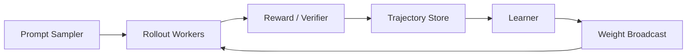

# Q095 设计一个大规模 PPO/GRPO Rollout 系统。

> **题型**：系统设计 ｜ **频率**：★★★★★ ｜ **难度**：★★★★★ ｜ **岗位**：RL Infra/LLM  
> **来源层级**：本页“PDF 原始要点”来自仓库内原版 PDF；“Repo 扩展解析”是在不改变原结论的前提下新增的理论、工程与面试组织内容。

[← Q094](Q094-long-cot-length.md) · [章节首页](README.md) · [Q096 →](Q096-policy-lag.md)

## 1. 面试官真正想确认什么

这不是单纯的名词解释题。面试官通常会顺着 **定义 → 数学对象 → 为什么有效 → 什么时候失效 → 如何实现/监控 → 如何迁移到项目** 连续追问。

系统/Debug 题没有唯一公式答案，评分重点是你是否建立可观测性：先确认数据和 reward 正确，再看统计信号，最后定位到优化器、策略版本和系统吞吐。成熟回答需要给出**可验证的排查顺序**，而不是罗列十几个可能原因。

## 2. 30 秒回答（PDF 原始要点）

> 将 prompt sampling、rollout inference、reward/verifier、trajectory storage、advantage、learner、weight broadcast 解耦；核心是让 rollout 和 learner 持续流水而非相互等待。

面试开场建议只讲这一层；如果面试官点头继续，再进入后面的推导与 failure mode。

## 3. 深入解析（PDF 原始要点）

- rollout 侧：vLLM/SGLang 类 continuous batching、KV cache、长短序列调度。
- reward 侧：CPU/GPU verifier 分层，异步并发。
- learner：FSDP/Megatron/ZeRO，gradient accumulation。
- 一致性：给 trajectory 记录 policy_version，限制 stale rollout。
- 观测：tokens/s、p95 latency、KL、entropy、reward std、GPU util。

## 4. Repo 扩展解析：把概念放回统一框架

系统/Debug 题没有唯一公式答案，评分重点是你是否建立可观测性：先确认数据和 reward 正确，再看统计信号，最后定位到优化器、策略版本和系统吞吐。成熟回答需要给出**可验证的排查顺序**，而不是罗列十几个可能原因。

### 4.1 推导/证明应该从哪里开始

先按同一 prompt 采样 G 个 response，计算组内 reward 的中心化/标准化，把它作为无显式 critic 的相对 advantage，再接 PPO-style ratio/clip。

### 4.2 关键公式

这道题更偏概念/系统设计。面试时仍建议先明确随机变量、目标函数和数据分布。

## 4.3 Repo v2 专业深化：从第一原则理解

大规模 PPO/GRPO 系统的核心是把 rollout、reward、learner、weight sync 解耦，并让每条 trajectory 带完整 policy/version provenance。系统瓶颈常在 autoregressive rollout 而不是 backward。

### 数学/推导抓手

吞吐可粗分：rollout tokens/s、reward eval/s、learner tokens/s；整体受最慢 stage 与同步 barrier 限制。

> **面试要求**：这里的公式不是“背出来就结束”。需要能解释每个期望是对什么随机变量取、哪些量来自 rollout、哪些量是 learned estimate、哪些分支必须 stop-gradient。

### 工程化检查点

- 组件：prompt sampler→rollout engine→reward/verifier→trajectory store→advantage→learner→checkpoint/broadcast。
- 必须设计 backpressure、失败重试、去重、版本一致性和 deterministic replay/debug。
- 先排数据/实现 bug，再调算法超参。
- 所有均值都至少配 p50/p95/p99 或按长度/难度切片。
- 系统吞吐与算法有效样本率必须一起优化。

### 面试中如何把回答从 70 分提升到 90 分

1. **先给结论**：一句话说明该方法解决的 failure mode。
2. **再写公式**：只写决定算法差异的那一项，不堆无关符号。
3. **解释估计误差**：指出 bias、variance、distribution shift 或 optimization instability 从哪里来。
4. **给反例**：说明算法在哪类数据/环境/系统条件下会失效。
5. **落到日志**：说清你会看哪些指标来验证判断，而不是“调参试试”。

## 5. 工程实现与训练观测

工程实现时建议把“数据形状、mask、旧策略版本、target/stop-gradient 边界、归一化维度”写在代码旁边。RL 中大量 bug 不会报错，而会以训练慢、KL 异常、value 爆炸或 reward 假提升的形式出现。

### 推荐观测项

- **数据层**：状态/动作/response mask 是否正确，terminal/truncation、policy version、reward component 是否可追踪。
- **统计层**：均值之外同时看方差、分位数和按难度/长度/任务类型切片的分布。
- **优化层**：loss、gradient norm、value/Q/advantage/ratio/KL/entropy 中与本题相关的量是否同步变化。
- **真实目标层**：训练 reward 上升是否真的带来 held-out return / accuracy / pass@k / success rate 提升。

## 6. 常见失败模式与排查

- group reward 方差接近 0，relative advantage 没有区分信号
- 只看平均值掩盖长尾/分组异常
- 实验不可复现：数据、模型、配置版本未固化

排查原则：**先证伪数据与实现 bug，再讨论算法超参；先看分布，再看平均值。**

## 7. 高频追问

- 同步 vs 异步 RL 的权衡？
- 权重广播如何避免停顿？

### 推荐追问回答结构

1. 先给一句结论；
2. 写出最关键公式/数据分布；
3. 解释为什么该公式能解决上一层 failure mode；
4. 给一个反例或失效场景；
5. 最后落到工程监控或项目经验。

## 7.1 高频追问参考答法

### 追问 1：同步 vs 异步 RL 的权衡？

大规模 PPO/GRPO 系统的核心是把 rollout、reward、learner、weight sync 解耦，并让每条 trajectory 带完整 policy/version provenance。系统瓶颈常在 autoregressive rollout 而不是 backward。

回答时继续补一层：先说明**为什么**，再指出一个**边界条件/失败现象**，最后给出一个可观测指标或实现检查点。

### 追问 2：权重广播如何避免停顿？

组件：prompt sampler→rollout engine→reward/verifier→trajectory store→advantage→learner→checkpoint/broadcast。

回答时继续补一层：先说明**为什么**，再指出一个**边界条件/失败现象**，最后给出一个可观测指标或实现检查点。

## 8. 易错点

> 只画“Actor→Learner”框图不够，要指出端到端瓶颈与一致性协议。

## 9. 面试官评分标准

> 优秀回答应同时覆盖定义/公式、为什么成立、失败模式与项目迁移。

可以进一步按四档自评：

| 档位 | 表现 |
|---|---|
| 及格 | 能准确给定义和主公式 |
| 良好 | 能解释每一项、算法动机与典型优缺点 |
| 优秀 | 能说明 failure mode、边界条件和替代方案 |
| 强工程/研究 | 能从日志、数据分布、系统成本或项目迁移给出可验证判断 |

## 10. 白板自测

在不看答案的情况下，尝试完成：

- 用 **3 句话**重新回答本题；
- 从第一原则推导/解释核心公式，而不是默写；
- 给出一个“这个方法会失败”的具体环境或训练现象；
- 说明你会记录哪 3 个指标来验证自己的判断。

## 11. 延伸阅读

- [Proximal Policy Optimization Algorithms](https://arxiv.org/abs/1707.06347)
- [DAPO: An Open-Source LLM Reinforcement Learning System at Scale](https://arxiv.org/abs/2503.14476)
- [DeepSeek-R1 incentivizes reasoning in LLMs through reinforcement learning](https://www.nature.com/articles/s41586-025-09422-z)

## 12. 90 秒专业回答

> **结论先行**：将 prompt sampling、rollout inference、reward/verifier、trajectory storage、advantage、learner、weight broadcast 解耦；核心是让 rollout 和 learner 持续流水而非相互等待。

继续展开时，先把它放回本章的统一问题框架：**rollout 侧：vLLM/SGLang 类 continuous batching、KV cache、长短序列调度。；reward 侧：CPU/GPU verifier 分层，异步并发。**。随后写出本题最关键的数学对象：`见上文推导`。最后必须补一句工程判断：公式成立不代表实现健康，需要用本页列出的分布指标、边界条件和 failure mode 验证。

一个高质量的 90 秒回答应满足：

- **前 15 秒**：明确“这个方法解决什么问题”；
- **15–45 秒**：给核心公式，并解释符号来自哪个数据分布；
- **45–70 秒**：讲一个典型失败模式或 tradeoff；
- **70–90 秒**：落到实现/日志，并说明如何验证。

> **不要这样答**：只按论文顺序背名词。面试官通常更在意你能否从 failure mode 推回设计，再从设计推到可观测指标。

## 13. 最小可验证实验

**实验目标**：不是做 leaderboard，而是把本题的核心机制变成可以 falsify 的小实验。

1. **环境/数据**：构造一个故意注入故障的最小 pipeline：错误 mask、极端长度、stale policy 或错误 reward parser。
2. **记录与对照**：观察指标联动，并验证监控能否在最终 reward 明显下降前发现异常。
3. **验收标准**：系统题的“实验”应证明可观测性、背压、版本一致性与故障恢复设计有效。

针对本题额外要求：把 **“设计一个大规模 PPO/GRPO Rollout 系统。”** 对应的关键变量单独画分布或写断言；如果实验结果和理论预期相反，优先检查数据定义、mask/terminal、旧策略版本和归一化维度，再讨论超参数。

---

[← Q094](Q094-long-cot-length.md) · [章节首页](README.md) · [Q096 →](Q096-policy-lag.md)
